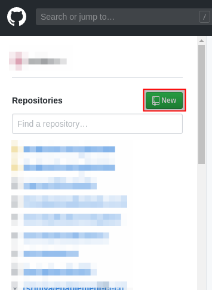

# Creating a GitHub account
To create a new GitHub account, perform the following steps:

Navigate to https://github.com using a web browser.

Enter the required details and then click Sign up for GitHub.


You will receive an email with instructions on how to activate your GitHub account. Verify your email address and then sign in to the GitHub website using the username and password you provided during account creation.

After you have logged in to GitHub, you can create new Git repositories by clicking New in the Repositories pane on the left of the GitHub home page.




Alternatively, click the plus icon (+) in the upper-right corner (to the right of the bell icon) and then click New repository.


Creating a new repository will also present you with some commands to help you get started when setting up your git CLI.

For example, initialising a new repository and adding it as a remote

```
echo "# myrepository" >> README.md
git init
git add README.md
git commit -m "first commit"
git remote add origin https://github.com/lfloris/myrepository.git
git push -u origin master
```

This will allow you to start creating code locally.

Create a test file

```
touch mytest
```

Commit this code, then push to the repository master branch

```
git add .
git commit -m "my first file"
git push -u origin master
```