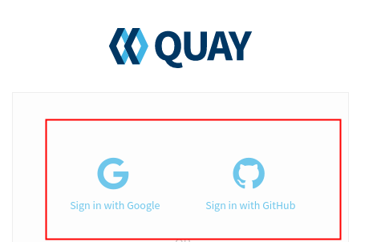
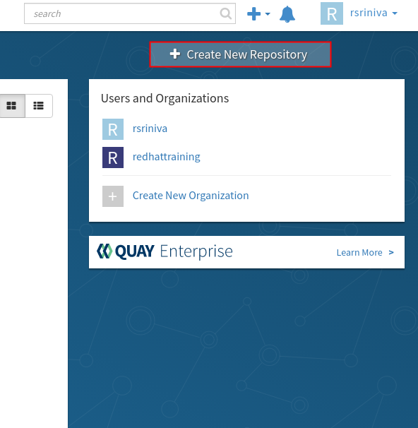
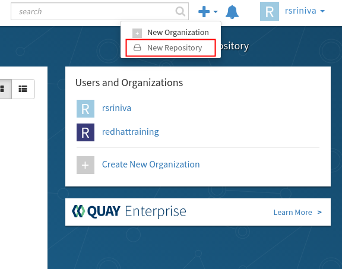

# Creating a Quay account

To create a new Quay account, perform the following steps:

Navigate to https://quay.io using a web browser.

Click Sign in in the upper-right corner (next to the search bar).

On the Sign in page, you can log in using your Google or GitHub credentials (created previously).

Alternatively, click Create Account to create a new account.

If you chose to skip the Google or GitHub log-in method and instead opted to create a new account, you will receive an email with instructions on how to activate your Quay account. Verify your email address and then sign in to the Quay website with the username and password you provided during account creation.

After you have logged in to Quay you can create new image repositories by clicking Create New Repository on the Repositories page.

Alternatively, click the plus icon (+) in the upper-right corner (to the left of the bell icon), and then click New Repository.

