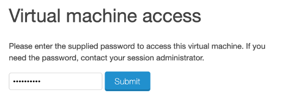
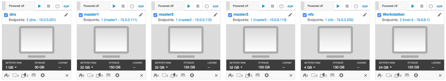
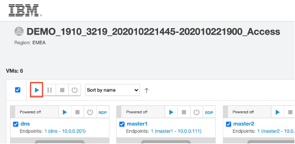
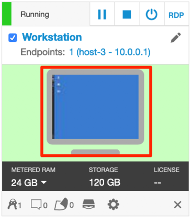

# Getting started with the labs

Use the guides in this directory as a starting point to tackle common tasks.

## Accessing the Lab VMs

Access the URL to your demo instance from the email sent to you by the instructor and enter the password provided. This email will have been sent to you before the scheduled start time.




This will open the main console.

Six Linux VMs have been provided for this lab. 




• The Red Hat OpenShift Container Platform (RHOCP) v4.4, is installed in 4 VMs, the master1 VM, the master2 VM, the master3 VM, and the DNS VM, with 3 master nodes and 3 compute nodes (the master nodes are serving as compute nodes as well).

• The Workstation VM is the one you will use to access and work with the RHOCP cluster in this lab. The login credentials for the Workstation VM are: 

User ID: ibmdemo 
Password: passw0rd 

Note: Use the Password above in the Workstation VM Terminal for sudo in the Lab.

The Workstation VMs provided are an Ubuntu 18.04LTS OS.

To start all the VMs, select the play icon



The Workstation Linux Desktop is displayed. You will execute all the lab tasks on this VM.



## Cloning the Git Repository

The Labs are located at https://github.com/lfloris/openshift-service-mesh-workshop/tree/main/Labs

On your Workstation VM, in your home directory clone the whole repo to your local machine.

```
$ git clone https://github.com/lfloris/openshift-service-mesh-workshop.git ibm-ocp-training/
```

This should copy all the labs and any resources to your machine.