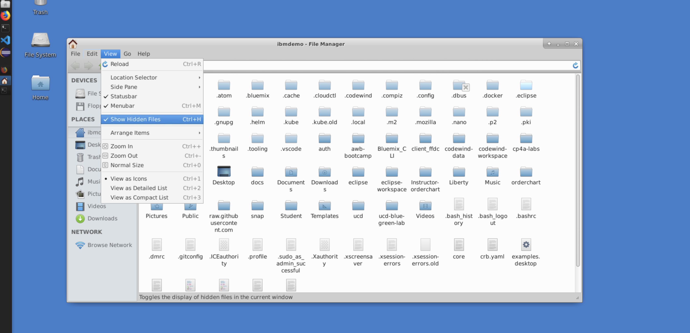

# Changing the Current Directory Display

In the default settings for the Student VMs, the command line displays the full directory path which can take up a lot of the screen.

Open the File Manager from the left pane, and then select View > Show Hidden Files

Find and open `.bashrc`

You'll need to edit the line similar to `PS1='${debian_chroot:+($debian_chroot)}\[\033[01;32m\]\u@\h\[\033[00m\]:\[\033[01;34m\]\W\[\033[00m\]\$ '`, changing the `\w` to `\W`.

Save and close the file.

Start a new terminal session and you should now only see the current directory displayed.