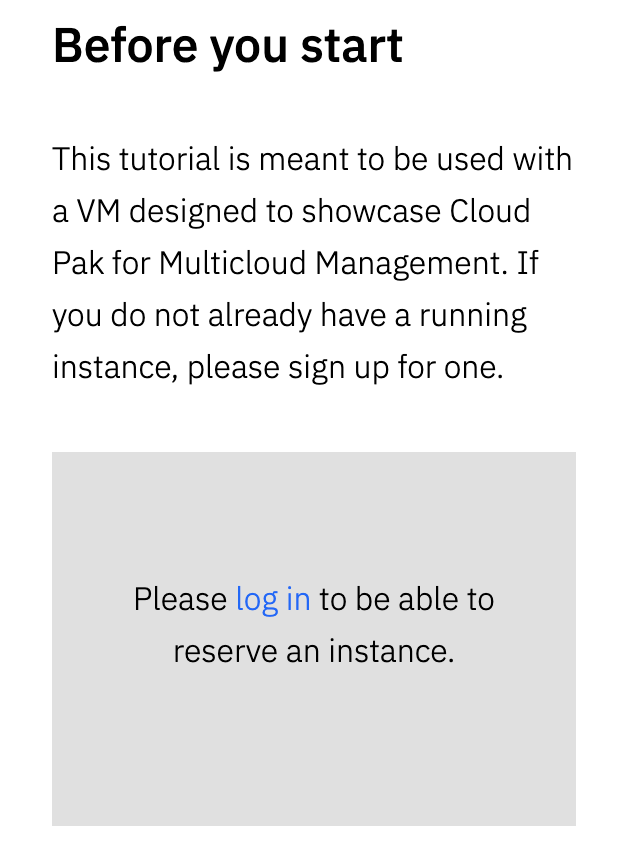
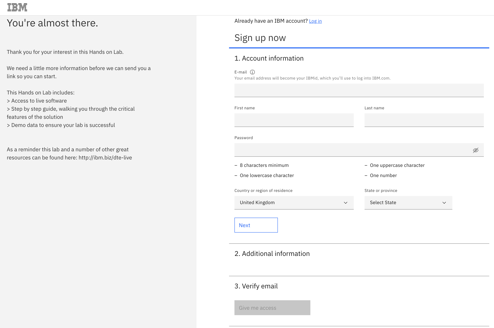

# Creating an IBM Account for Lab Exercises

In some of the lab execises, you may wish to use a dedicated demo environment for yourself as opposed to the provided shared environment. You can access the demo labs by visiting the relevant lab exercise and selecting the 'Log in' link on the right side of the page.

After this, sign up to register for an IBM ID with your details. 

You will shortly rececive an email to confirm your registration. Once confirmed, follow the instructions to reserve a demo environment assciated with your IBM ID. 

Once you're signed up and logged in, you can reserve the demo environment.

You'll be sent an email with the instructions and credentials for accessing the lab.