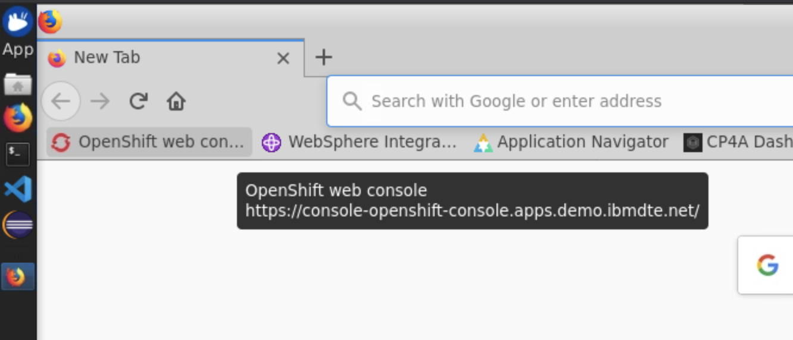
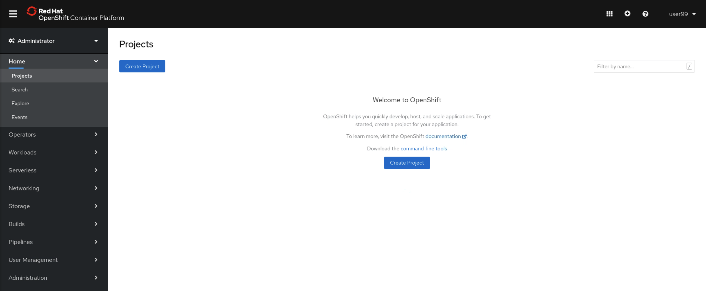

# Logging in to the OpenShift Environment

Open the Workstation VM window and log in with the following credentials

User: ibmdemo

Password: passw0rd

# Using the OpenShift Console

In your Workstation VM, open the Firefox browser. The link to the OpenShift environment is bookmarked.



From the log in screen, select "htpasswd" from the login options. A username and password should already auto-complete. This user is `ibmadmin` and the password is `engageibm`

Select 'Log In'. This should take you to the OpenShift Project Dashboard



This user is a cluster administrator account, meaning you have full access to all resources and actions in the cluster.

# Using the oc CLI

In your Workstation VM, open a new Terminal window.

To log in, use `oc login` with the OpenShift API Server endpoint. You'll be prompted to enter your user name and password. Once successfully authenticated, you'll receive a Login successful messsage.

For this lab, the  OpenShift API Server endpoint is https://api.demo.ibmdte.net:6443.

```
$ oc login https://api.demo.ibmdte.net:6443
Authentication required for https://api.demo.ibmdte.net:6443 (openshift)
Username: ibmadmin
Password: 
Login successful.

You have access to 65 projects, the list has been suppressed. You can list all projects with 'oc projects'

Using project "default".
```


