# Lab 2 - Advanced Use Cases with Red Hat OpenShift Service Mesh

In this lab you'll learn how to deploy an application configured to use the OpenShift Service Mesh.

To get started, log into OpenShift using the UI or CLI, as described [here](../Getting-started/log-in-to-openshift.md).

A set of helpful common `oc` commands can be found [here](../Getting-started/oc-commands.md).

This lab relies on completing [Lab 1 - Deploying an Application using Red Hat OpenShift Service Mesh](deploying-apps-on-service-mesh.md).

## Exercise 1 - Deploying additional gateways

In this exercise we'll look at how we create additional ingress gateway components and use them in conjunction with an ingress controller to create a new URL for accessing the Bookinfo application.

First, we'll need to create a new ingress controller that watches ingress resources created for a specific domain. The below YAML defines a new ingress router with the domain `dedicated.demo.ibmdte.net`.

Create a file called `ingress-controller.yaml` with the following content

```
apiVersion: operator.openshift.io/v1
kind: IngressController
metadata:
  name: dedicated-istio
  namespace: openshift-ingress-operator
spec:
  domain: dedicated.demo.ibmdte.net
  logging:
    access:
      destination:
        type: Container
  routeSelector:
    matchLabels:
      ingress: dedicated
  replicas: 1
```

Apply the file

```
$ oc create -f ingress-controller.yaml
```

Check the pod is running

```
$ oc -n openshift-ingress get pods
NAME                                      READY   STATUS    RESTARTS   AGE
router-dedicated-istio-7c447cbbd4-vhr8z   2/2     Running   0          60s
router-default-66dcdb948f-25dwc           1/1     Running   0          47m
router-default-66dcdb948f-pvtt5           1/1     Running   0          51m
```

Notice that we use a `routeSelector` here to only match routes that have the label `ingress=dedicated` set. This type of router sharding allows us to control how Ingress Controllers route traffic to target Routes.

Edit the Service Mesh Control Plane in the GUI by navigating to Installed Operators > OpenShift Service Mesh then select the tab Istio Service Mesh Control Plane. Select `basic-install`, then the YAML tab and scroll down until you reach around line 635.

In the `spec.gateways` section add a definition for a new gateway using the code snippet below
```
spec:
  gateways:
    additionalIngress:
      dedicated-gateway:
        enabled: true
        runtime:
          deployment:
            autoScaling:
              enabled: true
              maxReplicas: 2
              minReplicas: 1
              targetCPUUtilizationPercentage: 95
            replicas: 1
```

Select Save. 

After a minute or two, the new gateway pod should be scheduled.

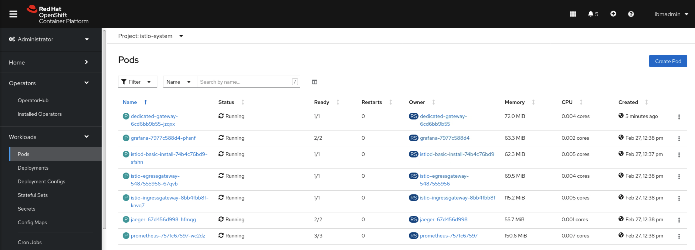

After the dedicated-gateway pod is running, we should also have a new service. From this service, we can create a new route which is what will be used to access the application later on.

```
$ oc -n istio-system expose service dedicated-gateway --name=dedicated --port=http2 --generator="route/v1" --hostname apps.dedicated.demo.ibmdte.net -l ingress=dedicated
route.route.openshift.io/dedicated exposed
```

We should now see our route created that consumes the service `dedicated-gateway`
```
$ oc -n istio-system get route
NAME                              HOST/PORT                                                           PATH   SERVICES               PORT    TERMINATION          WILDCARD
bookinfo-bookinfo-gateway-w7g7x   bookinfo-bookinfo-gateway-w7g7x-istio-system.apps.demo.ibmdte.net          istio-ingressgateway   http2                        None
dedicated                         apps.dedicated.demo.ibmdte.net                                             dedicated-gateway      8080                         None
dedicated-gateway                 dedicated-gateway-istio-system.apps.demo.ibmdte.net                        dedicated-gateway      8080                         None
grafana                           grafana-istio-system.apps.demo.ibmdte.net                                  grafana                <all>   reencrypt/Redirect   None
istio-ingressgateway              istio-ingressgateway-istio-system.apps.demo.ibmdte.net                     istio-ingressgateway   8080                         None
jaeger                            jaeger-istio-system.apps.demo.ibmdte.net                                   jaeger-query           <all>   reencrypt            None
prometheus                        prometheus-istio-system.apps.demo.ibmdte.net                               prometheus             <all>   reencrypt/Redirect   None]
```

The last step is to add the domain to the labs DNS server so we can resolve the `dedicated.demo.ibmdte.net` domain.

Create a file called `dedicateddemoibmdtenet` with the following content

```
address=/dedicated.demo.ibmdte.net/10.0.0.201
alias=10.0.0.3,10.0.0.201,255.255.255.0
```

SCP this file to the DNS server then restart dnsmasq using the below commands. When prompted for a password, use `passw0rd`.

```
$ scp dedicateddemoibmdtenet root@dns:/etc/dnsmasq.d/dedicateddemoibmdtenet
root@dns's password: 
dedicateddemoibmdtenet 
$ ssh root@dns 'service dnsmasq restart'
root@dns's password: 
Redirecting to /bin/systemctl restart dnsmasq.service
```

Now go to your browser and use the URL `http://apps.dedicated.demo.ibmdte.net/productpage`

You should see the Bookinfo application page appear

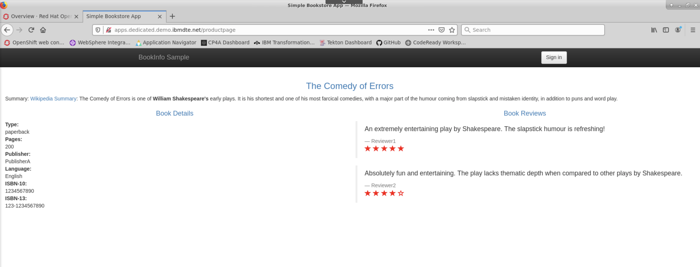


## Exercise 2 - Routing Traffic to Application Versions

In this exercise you'll learn how to route traffic to version 1 for all users, and to version 2 for the user `ibmuser`. This is to simulate a blue-green approach when deploying new microservices as part of an application, but you want to ensure that it is working for a subset of users before publishing the service.

The Service Mesh Bookinfo sample application consists of four separate microservices, each with multiple versions. Three different versions, one of the microservices called reviews, have been deployed and are running concurrently.

To illustrate the problem this causes, access the bookinfo app /productpage in a browser and refresh several times.

Sometimes the book review output contains star ratings and other times it does not. Without an explicit default service version to route to, Service Mesh routes requests to all available versions one after the other.

Here, we're going to apply rules that route all traffic to v1 (version 1) of the microservices. Later, we will apply a rule to route traffic based on the value of an HTTP request header.

Run the following command to set all VirtualService to route to version 1
```
$ oc -n bookinfo apply -f https://raw.githubusercontent.com/Maistra/istio/maistra-1.1/samples/bookinfo/networking/virtual-service-all-v1.yaml
virtualservice.networking.istio.io/productpage created
virtualservice.networking.istio.io/reviews created
virtualservice.networking.istio.io/ratings created
virtualservice.networking.istio.io/details created
```

Verify the new VirtualServices were created
```
$ oc -n bookinfo get vs
NAME          GATEWAYS               HOSTS             AGE
bookinfo      ["bookinfo-gateway"]   ["*"]             111m
details                              ["details"]       10s
productpage                          ["productpage"]   10s
ratings                              ["ratings"]       10s
reviews                              ["reviews"]       10s
```

Go to the bookinfo application and refresh the page a few times. You should now see that the book reviews no longer has any star ratings.

In the next scenario, we're going to assume that a new reviews v2 service was deployed and we want to ensure it is working. 

Change the route configuration so that all traffic from a specific user is routed to a specific service version. In this case, all traffic from a user named jason will be routed to the service reviews:v2.

Note that Service Mesh doesn’t have any special, built-in understanding of user identity. This example is enabled by the fact that the productpage service adds a custom end-user header to all outbound HTTP requests to the reviews service.

Sign in with the user jason using the sign in button at the top right of the page


When the user is logged in, you should see the option to sign out


Run the following command to modify the reviews VirtualService.

```
$ oc apply -f https://raw.githubusercontent.com/Maistra/istio/maistra-1.1/samples/bookinfo/networking/virtual-service-reviews-test-v2.yaml
virtualservice.networking.istio.io/reviews configured
```

Confirm the rule is created:
```
$ oc get virtualservice reviews -o yaml
apiVersion: networking.istio.io/v1alpha3
kind: VirtualService
metadata:
  name: reviews
  ...
spec:
  hosts:
  - reviews
  http:
  - match:
    - headers:
      end-user:
        exact: jason
    route:
    - destination:
      host: reviews
      subset: v2
  - route:
    - destination:
      host: reviews
      subset: v1
```

Refresh the page and we should see stars now appear


If you try signing in with another user (pick any name, there is no real user database) you should see the stars disappear when using any other user.

In a real world scenario, as developers you should have an idea of what headers are sent through to various services. Features like this allow you to really isolate traffic flow at multiple levels and perform thoroughly tested deployments (outside of automated CICD test patterns)


## Exercise 3 - Traffic Shadowing with Prod and Pre-Prod Applications

Traffic shadowing is useful for testing a pre-production release before it's promoted to production. In this example, we're going to deploy version 1 of the Bookinfo application to a `bookinfo-prod` project and a new version of some services of the Bookinfo application to another project `bookinfo-preprod`. Then we'll mirror and check to ensure the new application is operating properly.

To start, as the `ibmadmin` user we will pre-create some resources to save us switching back and forth between users.

Create the `bookinfo-prod` project
```
$ oc new-project bookinfo-prod --as=ibmuser --as-group=system:authenticated --as-group=system:authenticated:oauth
```

Create the `bookinfo-preprod` project
```
$ oc new-project bookinfo-preprod --as=ibmuser --as-group=system:authenticated --as-group=system:authenticated:oauth
```

For the remaining tasks, log into OpenShift using the CLI with the user `ibmuser`, as described [here](../Getting-started/log-in-to-openshift.md).

### Setting up the Production Project
Create the ServiceMeshMember object by creating a file called `servicemeshmember-bookinfo-prod.yaml` with the following content

```
apiVersion: maistra.io/v1
kind: ServiceMeshMember
metadata:
  name: default
  namespace: bookinfo-prod
spec:
  controlPlaneRef:
    namespace: istio-system
    name: basic-install
```

Then deploy it

```
$ oc create -f servicemeshmember-bookinfo-prod.yaml
```

Deploy the Bookinfo application

```
$ oc apply -n bookinfo-prod -f https://raw.githubusercontent.com/Maistra/istio/maistra-2.0/samples/bookinfo/platform/kube/bookinfo.yaml
```

Delete the `reviews-v2` and `reviews-v3` deployments, since we're not using them in this release.

```
$ oc -n bookinfo-prod delete deployments reviews-v2 reviews-v3
deployment.apps "reviews-v2" deleted
deployment.apps "reviews-v3" deleted
```

Apply the required DestinationRules

```
$ oc apply -n bookinfo-prod -f https://raw.githubusercontent.com/Maistra/istio/maistra-2.0/samples/bookinfo/networking/destination-rule-all-mtls.yaml
```

Create the following VirtualService

```
apiVersion: networking.istio.io/v1beta1
kind: VirtualService
metadata:
  name: bookinfo
  namespace: bookinfo-prod
spec:
  gateways:
  - bookinfo-gateway
  hosts:
  - 'bookinfo-prod.apps.demo.ibmdte.net'
  http:
  - match:
    - uri:
        exact: /productpage
    - uri:
        prefix: /static
    - uri:
        exact: /login
    - uri:
        exact: /logout
    - uri:
        prefix: /api/v1/products
    route:
    - destination:
        host: productpage
        port:
          number: 9080
```

Create the following Gateway

```
apiVersion: networking.istio.io/v1beta1
kind: Gateway
metadata:
  name: bookinfo-gateway
  namespace: bookinfo-prod
spec:
  selector:
    istio: ingressgateway
  servers:
  - hosts:
    - 'bookinfo-prod.apps.demo.ibmdte.net'
    port:
      name: http
      number: 80
      protocol: HTTP
```


Check the Kiali user interface to ensure you can see the `bookinfo-prod` namespace as the user `ibmuser`. Before Kiali shows any topology data, we need to send some actual traffic through the mesh.

Since we configured our Gateway to use the host `bookinfo-prod.apps.demo.ibmdte.net`, a Route should have been automatically created in the `istio-system` project that will give us access to the application without any further configuration.

Either visit the URL `http://bookinfo-prod.apps.demo.ibmdte.net/productpage` in the web browser, or use the following curl command

```
$ curl -s http://bookinfo-prod.apps.demo.ibmdte.net/productpage >/dev/null && echo "OK"
OK
```

Refresh the browser or run the curl command a few times to generate some load. Eventually Kiali will show the `bookinfo-prod` topology.

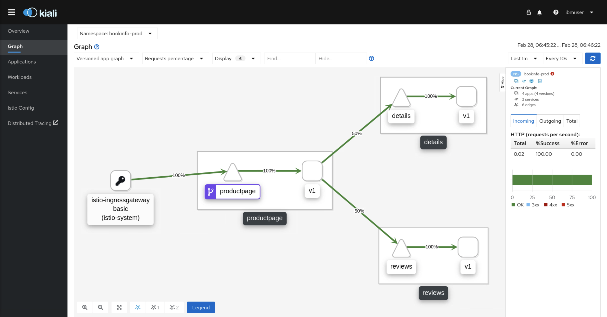

### Setting up the Pre-Production Project

Create the ServiceMeshMember object by creating a file called `servicemeshmember-bookinfo-preprod.yaml` with the following content

```
apiVersion: maistra.io/v1
kind: ServiceMeshMember
metadata:
  name: default
  namespace: bookinfo-preprod
spec:
  controlPlaneRef:
    namespace: istio-system
    name: basic-install
```

Then deploy it

```
$ oc create -f servicemeshmember-bookinfo-preprod.yaml
```

Deploy the Bookinfo application

```
$ oc apply -n bookinfo-preprod -f https://raw.githubusercontent.com/Maistra/istio/maistra-2.0/samples/bookinfo/platform/kube/bookinfo.yaml
```

Delete the `reviews-v1` and `reviews-v3` deployments, since we're not using them in this release.

```
$ oc -n bookinfo-preprod delete deployments reviews-v1 reviews-v3
deployment.apps "reviews-v1" deleted
deployment.apps "reviews-v3" deleted
```

Apply the required DestinationRules

```
$ oc apply -n bookinfo-preprod -f https://raw.githubusercontent.com/Maistra/istio/maistra-2.0/samples/bookinfo/networking/destination-rule-all-mtls.yaml
```

Create the following VirtualService

```
apiVersion: networking.istio.io/v1beta1
kind: VirtualService
metadata:
  name: bookinfo
  namespace: bookinfo-preprod
spec:
  gateways:
  - bookinfo-gateway
  hosts:
  - 'bookinfo-preprod.apps.demo.ibmdte.net'
  http:
  - match:
    - uri:
        exact: /productpage
    - uri:
        prefix: /static
    - uri:
        exact: /login
    - uri:
        exact: /logout
    - uri:
        prefix: /api/v1/products
    route:
    - destination:
        host: productpage
        port:
          number: 9080
```

Create the following Gateway

```
apiVersion: networking.istio.io/v1beta1
kind: Gateway
metadata:
  name: bookinfo-gateway
  namespace: bookinfo-preprod
spec:
  selector:
    istio: ingressgateway
  servers:
  - hosts:
    - 'bookinfo-preprod.apps.demo.ibmdte.net'
    port:
      name: http
      number: 80
      protocol: HTTP
```


Check the Kiali user interface to ensure you can see the `bookinfo-preprod` namespace as the user `ibmuser`. Before Kiali shows any topology data, we need to send some actual traffic through the mesh.

Since we configured our Gateway to use the host `bookinfo-preprod.apps.demo.ibmdte.net`, a Route should have been automatically created in the `istio-system` project that will give us access to the application without any further configuration.

Either visit the URL `http://bookinfo-preprod.apps.demo.ibmdte.net/productpage` in the web browser, or use the following curl command

```
$ curl -s http://bookinfo-preprod.apps.demo.ibmdte.net/productpage >/dev/null && echo "OK"
OK
```

Refresh the browser or run the curl command a few times to generate some load. Eventually Kiali will show the `bookinfo-preprod` topology.

If you apply load to both application simultaneously, you can use Kiali to show both applications on the same graph. This validates that we can see the traffic entering both applications and that both applications are working independently.

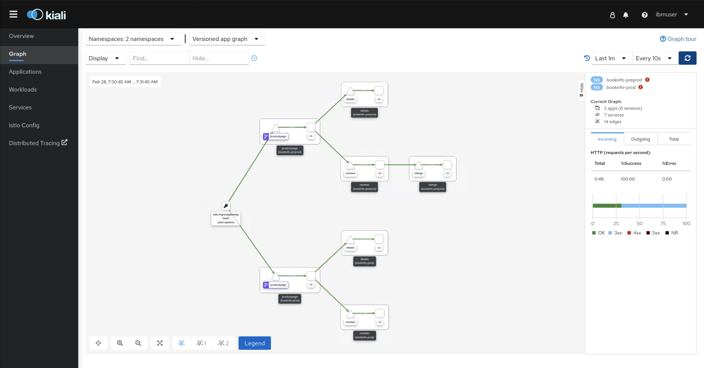

### Enabling Traffic Mirroring and Monitoring the Traffic

This step builds on the previous step and uses the traffic mirroring/shadowing features of Istio to duplicate traffic sent to one application into another application. In this scenario, we use this feature to send duplicate "production" traffic to both the `bookinfo-prod` and `bookinfo-preprod` so we can compare and contrast the latest version deployments in the pre-prod application using the information in Kiali and Jaeger.

#### Enabling Mirroring

Mirroring of traffic from the `bookinfo-prod` to the `bookinfo-preprod` is done by adding a new `mirror` entry to the `bookinfo` VirtualService in the `bookinfo-prod` project. In this case, we'll mirror traffic to the `productpage` service in the `bookinfo-preprod` project.

Edit the  VirtualService to resemble the following

```
apiVersion: networking.istio.io/v1beta1
kind: VirtualService
metadata:
  name: bookinfo
  namespace: bookinfo-prod
spec:
  gateways:
  - bookinfo-gateway
  hosts:
  - 'bookinfo-prod.apps.demo.ibmdte.net'
  http:
  - match:
    - uri:
        exact: /productpage
    - uri:
        prefix: /static
    - uri:
        exact: /login
    - uri:
        exact: /logout
    - uri:
        prefix: /api/v1/products
    route:
    - destination:
        host: productpage
        port:
          number: 9080
    mirror:
      host: productpage.bookinfo-preprod.svc.cluster.local
      port:
        number: 9080
    mirror_percent: 100
```

Open a new terminal session and execute the below loop

```
$ while true; do curl -s http://bookinfo-prod.apps.demo.ibmdte.net/productpage >/dev/null && echo "OK";sleep 1; done
```

This will start pushing traffic to the prod application every second so we can check out what is happening.

Switch to Kiali, select both namespaces in the Namespaces drop down menu. We should be able to see that both applications are receiving traffic from only executing the curl loop against the prod endpoint.

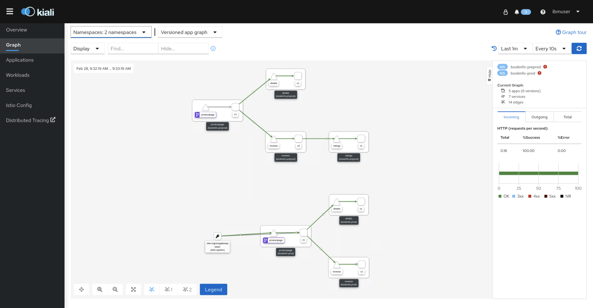

Now we can compare both applications to see the effects our app updates have had.

Since v1 of the application doesn't call to a ratings service, we can see the response time is fairly low

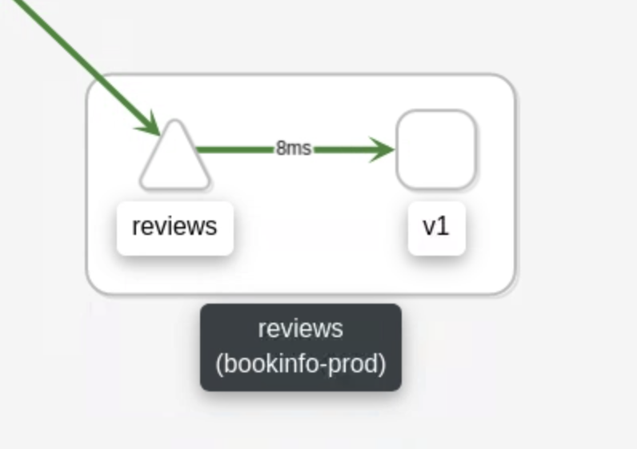

Let's check the pre-prod application

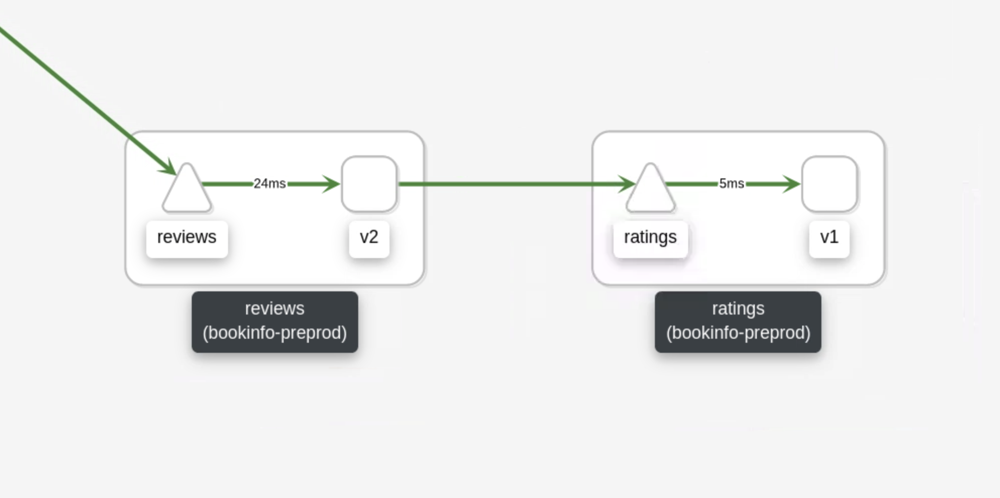

Here we see that the response time is increased, most likely because it is waiting on the ratings service also respond. We can check this in more detail using Jaeger.

On the pre-prod application, select the reviews service. On the right side of the screen we see more information about the requests in and out, the success/error rate and also information about the traces available. Select the tracing tab. This tab provides information about the spans of the request. Select a trace link, then at the bottom of the page select Show in Tracing.

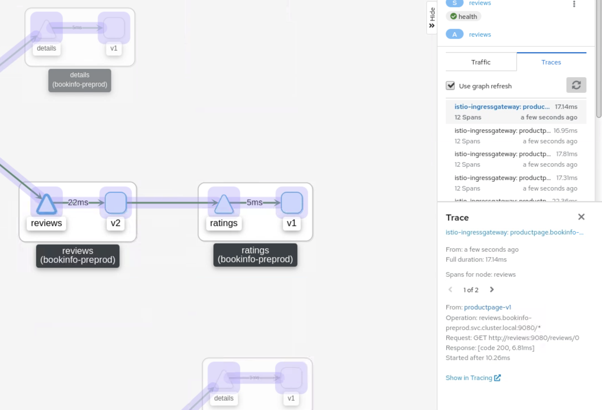

This will open Jaeger directly at the span you selected. Here we're presented with information about the flow of the request, right from the ingress gateway until the end of the application for both prod and pre-prod (since the traffic to pre-prod originated from the prod Bookinfo application).

Let's take a look at the span for productpage.bookinfo-prod to reviews.bookinfo-prod

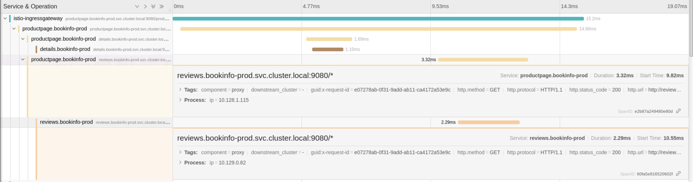

We can see the request to `reviews.bookinfo-prod.svc.cluster.local:9080/*` from productpage.bookinfo-prod took 3.32ms, with 2.29ms of that spent executing the service in the reviews pod.

Now let's look at the pre-prod equivalent.

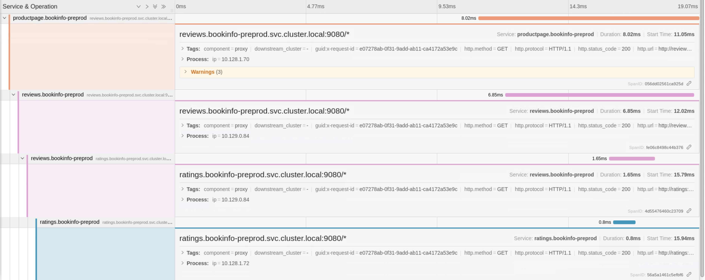

Naturally this process is going to take a little longer since there is an extra step in the process. Here we see that the whole reviews request took 6.85ms, more than double when we did not have any database present. But looking at the information available, the actual execution didn't start until 3.75ms in, meaning that there was potentially some network lag. In this case, 3-4ms isn't such a big number, but this might be because the pods are located quite closely together across just 3 nodes. In a much larger cluster, with potentially 50-100 nodes for example, microservices *could* be spread across any of them which would increase the network lag even more. 

Using information like this we're able to monitor the network and execution times of services to build an overall picture of how the application performs and make decisions on whether or not we need to make changes. For example, a consistent lag between services that need to perform functions very quickly together, such as a transaction processing application, might benefit more from dedicated hardware instead of allowing the Kubernetes scheduler to determine where pods should be placed across a large number of nodes. Since the scheduler has zero knowledge of the application performance, it cannot intelligently schedule pods without us instructing it to do so.

## Exercise 4 - Service Mesh Application Debugging

In this exercise, we'll look at using the Jaeger and Kiali tools we have deployed to debug a service that isn't running correctly. We'll deploy a new version (v2) of the details service that has an error in it.

Switch back to the `bookinfo` project using `oc project bookinfo`.

Create a new file called `details-v2-deployment.yaml` with the following content.

```
apiVersion: apps/v1
kind: Deployment
metadata:
  name: details-v2
  labels:
    app: details
    version: v2
spec:
  replicas: 1
  selector:
    matchLabels:
      app: details
      version: v2
  template:
    metadata:
      annotations:
        sidecar.istio.io/inject: "true"
      labels:
        app: details
        version: v2
    spec:
      serviceAccountName: bookinfo-details
      containers:
      - name: details
        image: maistra/examples-bookinfo-details-v2:2.0.0
        imagePullPolicy: IfNotPresent
        ports:
        - containerPort: 9080
        env:
        - name: DO_NOT_ENCRYPT
          value: "true"
```

Create the deployment

```
$ oc -n bookinfo create -f details-v2-deployment.yaml
deployment.apps/details-v2 created
```

Check that the pod says it is running.

```
$ oc get pods -l app=details,version=v2
NAME                         READY   STATUS    RESTARTS   AGE
details-v2-5bbf5fd88-l65rq   2/2     Running   0          16s
```

In a new terminal window, run a curl loop to continuously push traffic through the Bookinfo application.

Now check back in the Kiali user interface. After a short amount of time we should see the details-v2 service has been added to the topology, but this time our graph shows red lines going through the details v2 service.

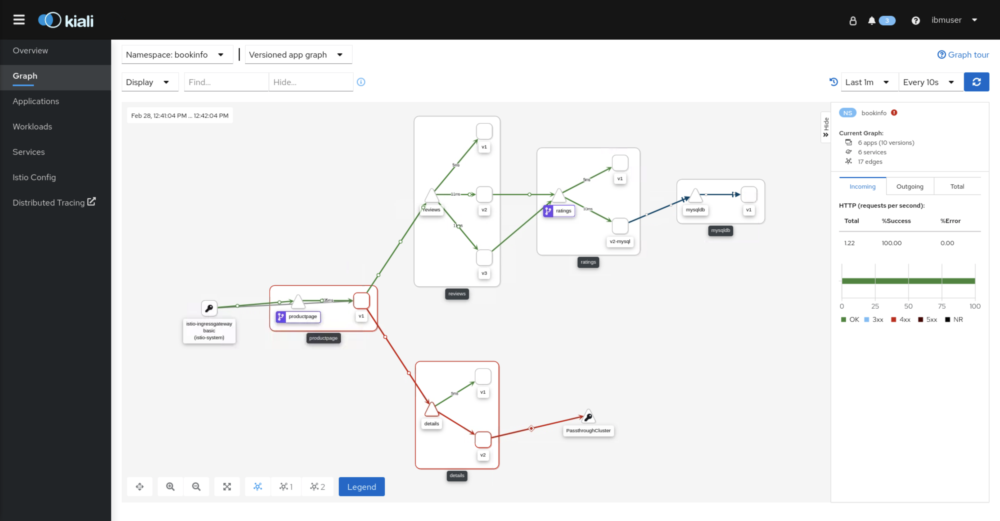

Kiali is indicating to us that there is an issue with this particular flow of traffic and needs our attention. Select the details service.

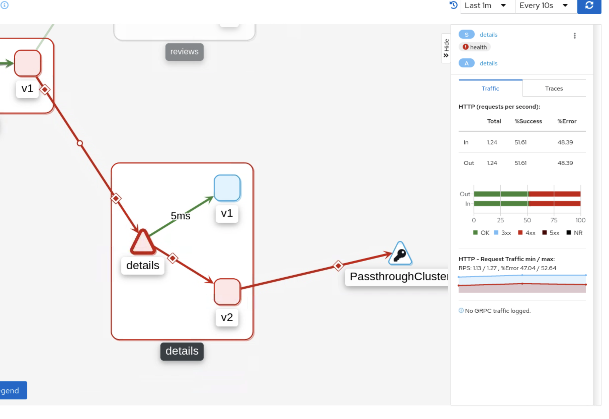

Note the Traffic tab on the right says that we're getting a 50/50 success/error rate. This is because by default the VirtualService will evenly distribute requests across the target endpoints evenly unless we specify a `weight` in the VirtualService.

Select the v2 square icon to start looking into why the service has failed. If we look at the Traces tab again, and select any of the traces, we can see that there are 3 activities in the request. Select the right arrow (>) until you reach 3 of 3. This gives us the reason why the service has failed and it states 

```
Operation: www.googleapis.com
Request: GET http://www.googleapis.com/books/v1/volumes?q=isbn:0486424618
Response: [code 403, 99.77ms]
Started after 11.17ms
```

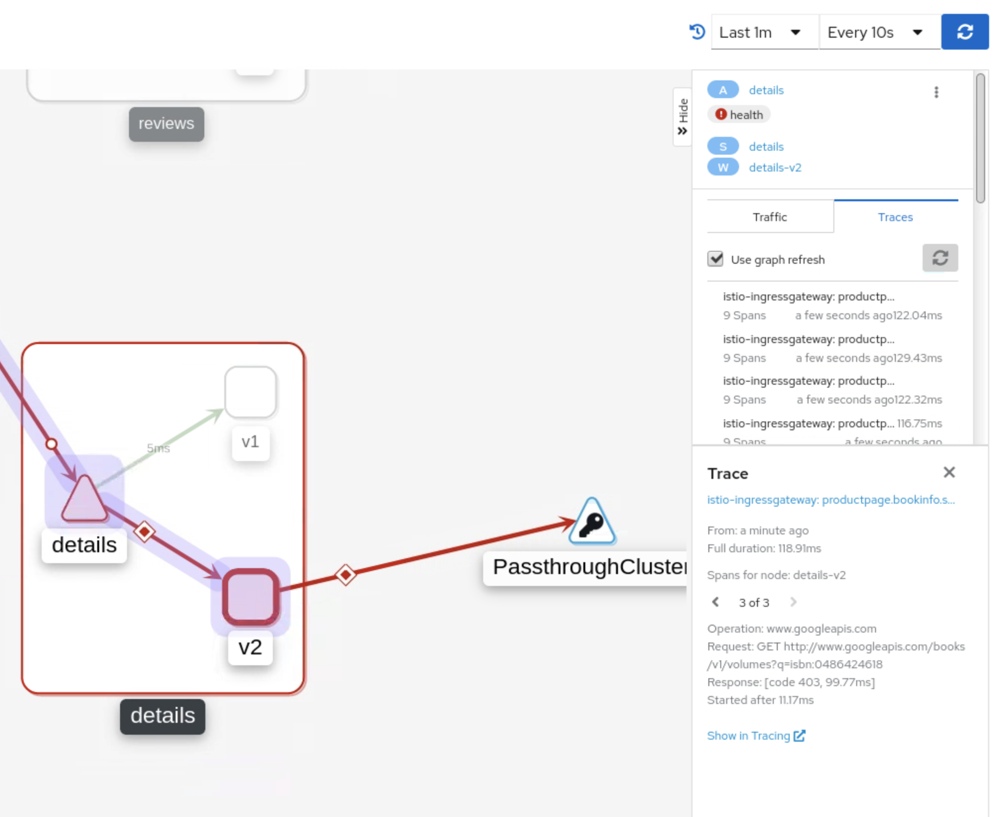

We know that a HTTP 403 means Forbidden, so this service is trying to reach an API endpoint it is not authorised to use. If we put this URL in a browser, we can see the same error.

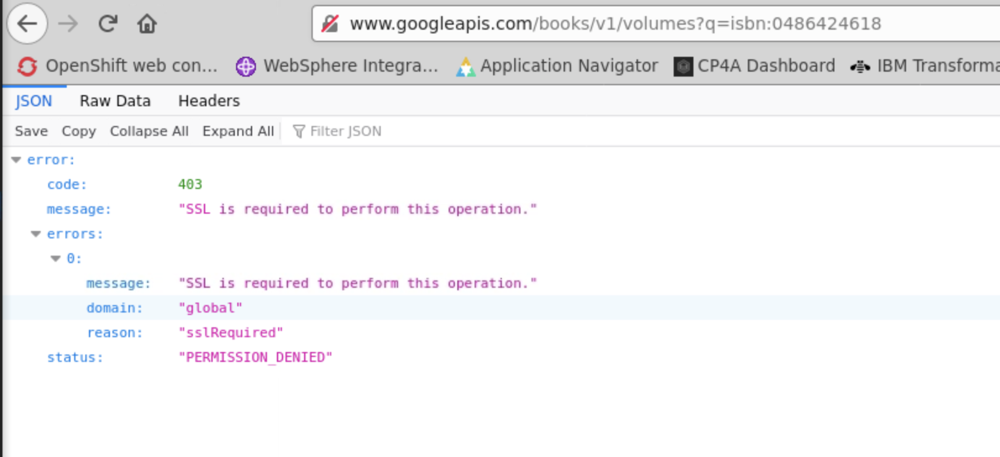

So now that we know the error, we can work on resolving it. The message in the response indicates that SSL is required, so we should be using an HTTPS connection, not HTTP.

In the OpenShift console, go to the details-v2 deployment in the `bookinfo` project. Select the Environment tab and change the `DO_NOT_ENCRYPT` value from `true` to `false`.

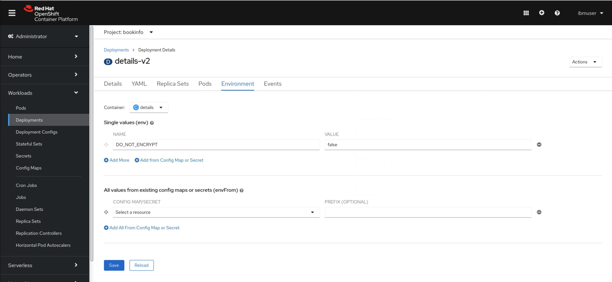

Select Save.

This should automatically restart the pod. From here, the logical step is to check the pod logs to see if we get any other repercussions from making the change.

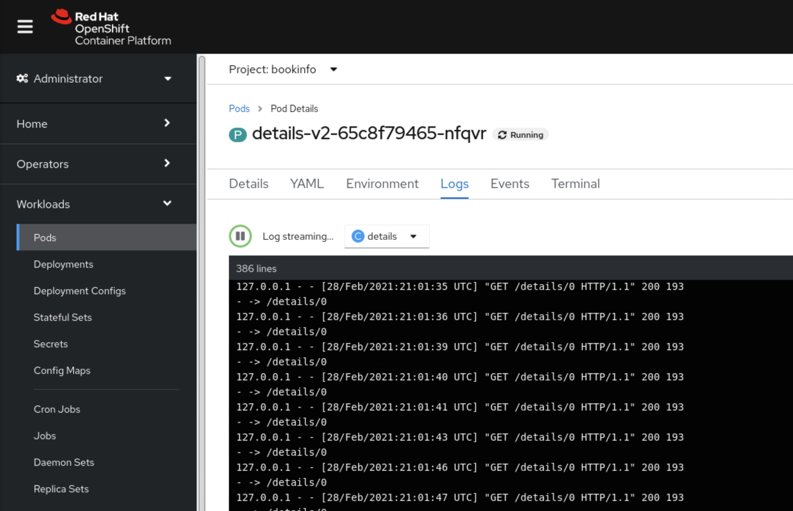

Check Kiali again. We should now see that the flow is green.

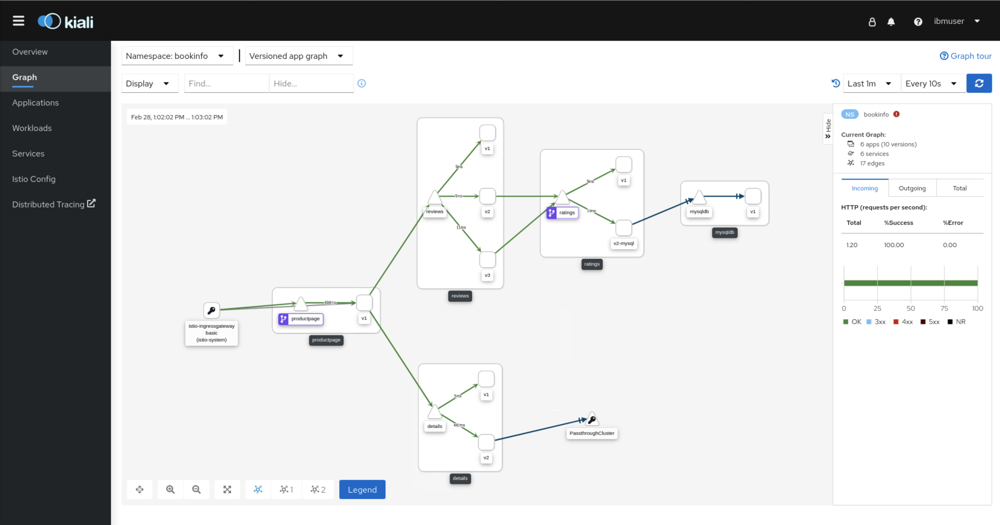

In a real world example, it might not be as simple as changing an environment variable. It could be an entire code change and an image rebuild but the key thing here is that we were able to visually see the broken traffic flow and inspect the error from the Kiali console. This kind of observability can help you focus more on fixing the issues instead of figuring them out.

Lab complete.