# Lab 1 - Deploying an Application using Red Hat OpenShift Service Mesh 2.0

In this lab you'll learn how to deploy an application configured to use the OpenShift Service Mesh.

To get started, log into OpenShift using the UI or CLI, as described [here](../Getting-started/log-in-to-openshift.md).

A set of helpful common `oc` commands can be found [here](../Getting-started/oc-commands.md).

## Setting up the Service Mesh

The Service Mesh is already deployed to all projects within the cluster, but we need to deploy an initial Istio Control Plane. The ServiceMeshControlPlane resource defines the configuration to be used during installation. You can deploy the default configuration provided by Red Hat or customize the ServiceMeshControlPlane file to fit your business needs.

You can deploy the Service Mesh control plane by using the OpenShift Container Platform web console or from the command line using the oc client tool. This lab will use the oc CLI for the majority of the work.

Create a new project called `istio-system`

```
$ oc new-project istio-system
```

It may take some time for all of the required operators to automatically install within the new project. At a minimum, we need to be sure that the elasticsearch, jaeger, kiali and servicemesh ClusterServiceVersion objects are in `Succeeded` status. We can check this by using `oc -n istio-system get csv`

```
$ oc -n istio-system get csv
NAME                                            DISPLAY                          VERSION                  REPLACES                                        PHASE
appsody-operator.v0.5.1                         Appsody Operator                 0.5.1                                                                    Succeeded
elasticsearch-operator.4.3.40-202010141211.p0   Elasticsearch Operator           4.3.40-202010141211.p0   elasticsearch-operator.4.3.37-202009151447.p0   Succeeded
jaeger-operator.v1.17.6                         Red Hat OpenShift Jaeger         1.17.6                   jaeger-operator.v1.17.5                         Succeeded
kiali-operator.v1.12.16                         Kiali Operator                   1.12.16                  kiali-operator.v1.12.15                         Succeeded
open-liberty-operator.v0.5.1                    Open Liberty Operator            0.5.1                                                                    Succeeded
openshift-pipelines-operator.v0.11.2            OpenShift Pipelines Operator     0.11.2                                                                   Succeeded
postgresql-operator.v0.0.8                      PostgreSQL Database              0.0.8                                                                    Succeeded
serverless-operator.v1.7.2                      OpenShift Serverless Operator    1.7.2                    serverless-operator.v1.7.1                      Succeeded
service-binding-operator.v0.1.1-364             Service Binding Operator         0.1.1-364                service-binding-operator.v0.1.1-354             Succeeded
servicemeshoperator.v1.1.10                     Red Hat OpenShift Service Mesh   1.1.10-0                 servicemeshoperator.v1.1.8                      Succeeded
```

For our application, we'll use another project called `bookinfo`. 

Create the project on behalf of the user `ibmuser` so that they automatically become a member of that project

```
$ oc new-project bookinfo --as=ibmuser --as-group=system:authenticated --as-group=system:authenticated:oauth
```

### Deploying the Control Plane
Create a new file called `istio-installation.yaml` with the following content

```
apiVersion: maistra.io/v2
kind: ServiceMeshControlPlane
metadata:
  name: basic
  namespace: istio-system
spec:
  version: v2.0
  security:
    controlPlane:
      mtls: true
    dataPlane:
      mtls: true
  gateways:
    egress:
      runtime:
        deployment:
          autoScaling:
            enabled: false
      service: {}
    ingress:
      runtime:
        deployment:
          autoScaling:
            enabled: false
      service: {}
    openshiftRoute:
      enabled: true
  tracing:
    type: Jaeger
    sampling: 10000
  policy:
    type: Istiod
  telemetry:
    type: Istiod
  addons:
    jaeger:
      install:
        storage:
          type: Memory
    prometheus:
      enabled: true
    kiali:
      enabled: true
    grafana:
      enabled: true
  proxy:
    injection:
      autoInject: true
    runtime:
      container:
        resources:
          limits:
            cpu: 100m
            memory: 256Mi
          requests:
            cpu: 10m
            memory: 128Mi
```

If you want to learn more about all the possible configurations, see the [Red Hat OpenShift Documentation](https://docs.openshift.com/container-platform/4.4/service_mesh/v1x/customizing-installation-ossm.html)

Deploy the control plane

```
$ oc create -n istio-system -f istio-installation.yaml
```

Use the following command to check the installation status

```
$ oc get smcp -n istio-system
NAME            READY   STATUS              TEMPLATE   VERSION   AGE
basic-install   9/9     InstallSuccessful   default    v1.1      10m
```

Ensure the `STATUS` is `InstallSuccessful` before moving on. This may take some time.

Check the status of the pods to ensure they are all in `Running` status. This may take some time.

```
$ oc get pods -n istio-system
NAME                                   READY   STATUS    RESTARTS   AGE
grafana-7977c588d4-l7pm7               2/2     Running   0          9m46s
istio-egressgateway-7988d4487d-k9vnw   1/1     Running   0          11m
istio-ingressgateway-cfdfb66ff-27qbd   1/1     Running   0          11m
istiod-basic-7d8ccd96f7-zv2bw          1/1     Running   0          11m
jaeger-5ff9558fc6-67qhz                2/2     Running   0          10m
kiali-766764d687-xhtzz                 1/1     Running   0          8m56s
prometheus-d64765997-btzjs             3/3     Running   0          10m
```

### Creating a Service Mesh Member
ServiceMeshMember resources can be created by service mesh users who don’t have privileges to add members to the ServiceMeshMemberRoll directly. While project administrators are automatically given permission to create the ServiceMeshMember resource in their project, they cannot point it to any ServiceMeshControlPlane until the service mesh administrator explicitly grants access to the service mesh.

In this example, we'll provide this access to the `ibmuser` user.

Using the `ibmadmin` user (you should still be logged in as this user), run the following command
```
$ oc policy add-role-to-user --role-namespace istio-system -n istio-system mesh-user ibmuser
role.rbac.authorization.k8s.io/mesh-user added: "ibmuser"
```

Log into OpenShift using the CLI with the user `ibmuser`, as described [here](../Getting-started/log-in-to-openshift.md).

Create the ServiceMeshMember object by creating a file called `servicemeshmember.yaml` with the following content

```
apiVersion: maistra.io/v1
kind: ServiceMeshMember
metadata:
  name: default
  namespace: bookinfo
spec:
  controlPlaneRef:
    namespace: istio-system
    name: basic-install
```

Then deploy it

```
$ oc create -f servicemeshmember.yaml
```

## Deploying the Book Info Application

For this exercise we'll use a pre-existing sample application that properly demonstrates the Service Mesh capabilities. The application is composed of four separate microservices used to demonstrate various Istio features. The Bookinfo application displays information about a book, similar to a single catalog entry of an online book store. Displayed on the page is a description of the book, book details (ISBN, number of pages, and other information), and book reviews.

The Bookinfo application consists of these microservices:

- The productpage microservice calls the details and reviews microservices to populate the page.

- The details microservice contains book information.

- The reviews microservice contains book reviews. It also calls the ratings microservice.

- The ratings microservice contains book ranking information that accompanies a book review.

There are three versions of the reviews microservice:

- Version v1 does not call the ratings Service.

- Version v2 calls the ratings Service and displays each rating as one to five black stars.

- Version v3 calls the ratings Service and displays each rating as one to five red stars.

The application architecture is as follows

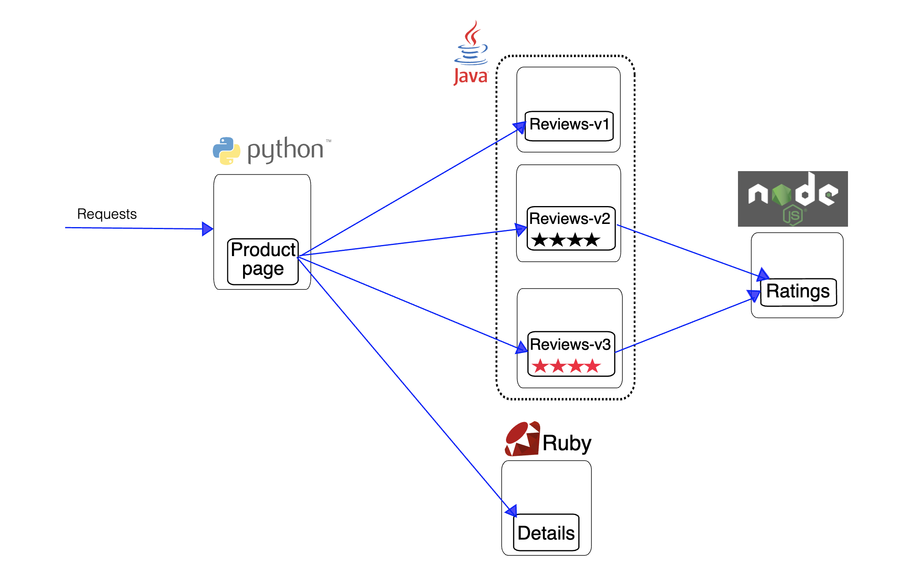

Deploy the application using the following command

```
$ oc apply -n bookinfo -f https://raw.githubusercontent.com/Maistra/istio/maistra-2.0/samples/bookinfo/platform/kube/bookinfo.yaml
service/details created
serviceaccount/bookinfo-details created
deployment.apps/details-v1 created
service/ratings created
serviceaccount/bookinfo-ratings created
deployment.apps/ratings-v1 created
service/reviews created
serviceaccount/bookinfo-reviews created
deployment.apps/reviews-v1 created
deployment.apps/reviews-v2 created
deployment.apps/reviews-v3 created
service/productpage created
serviceaccount/bookinfo-productpage created
deployment.apps/productpage-v1 created
```

Deploy the ingress gateway using the following command

```
$ oc apply -n bookinfo -f https://raw.githubusercontent.com/Maistra/istio/maistra-2.0/samples/bookinfo/networking/bookinfo-gateway.yaml
gateway.networking.istio.io/bookinfo-gateway created
virtualservice.networking.istio.io/bookinfo created
```

Before you can use the Bookinfo application, you have to add default destination rules. 

Deploy the pre-configured destination rules using the following command

```
$ oc apply -n bookinfo -f https://raw.githubusercontent.com/Maistra/istio/maistra-2.0/samples/bookinfo/networking/destination-rule-all-mtls.yaml
destinationrule.networking.istio.io/productpage created
destinationrule.networking.istio.io/reviews created
destinationrule.networking.istio.io/ratings created
destinationrule.networking.istio.io/details created
```

### Verify the Application

Ensure all pods of the application are running

```
$ oc get pods -n bookinfo
NAME                             READY   STATUS    RESTARTS   AGE
details-v1-7f94dd6cc5-n22h5      2/2     Running   0          67m
productpage-v1-75877fb77-vl7x8   2/2     Running   0          67m
ratings-v1-5b848c9bdc-gv5cx      2/2     Running   0          67m
reviews-v1-fcbd5864b-vcdfh       2/2     Running   0          67m
reviews-v2-7b5f7f9b7d-bdh68      2/2     Running   0          67m
reviews-v3-797bc9b798-gnlnw      2/2     Running   0          67m
```

Try to access the Bookinfo product page URL. You can do this in the browser using the Route that was created for the ingress gateway. This should look something like http://istio-ingressgateway-istio-system.apps.demo.ibmdte.net/productpage.

You should see a page similar to below

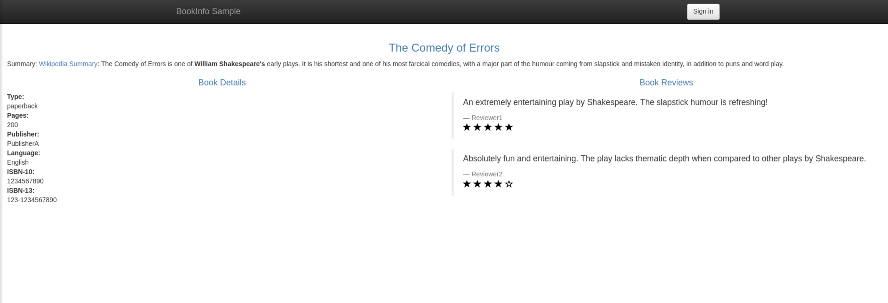

The application is working. Notice that when you refresh the page several times, the different versions of the review sections show.


## Observing the Application in Kiali

Use the following URL to access the Kiali dashboard

https://kiali-istio-system.apps.demo.ibmdte.net

Log in with `ibmuser`.

When you first log in, you see the Overview page which displays all the namespaces in your mesh that you have permission to view. In this case, we should only see the bookinfo project.

The Kiali operator works with the telemetry data gathered in Red Hat OpenShift Service Mesh to provide graphs and real time network diagrams of the applications, services, and workloads in your namespace.

The Overview page displays all the namespaces that have services in your mesh. You can reveal deeper insights about the data traveling through your Service mesh or help identify problems with services or workloads in your service mesh with the following graphs and visualizations.

Namespace graphs
The namespace graph is a map of the services, deployments and workflows in your namespace and arrows that show how data flows through them. To view a namespace graph:

1. Click Graph in the main navigation.

2. Select bookinfo from the Namespace menu.

If your application uses version tags, like the Bookinfo sample application, you can see a Version graph. Select a graph from the Graph Type drop down menu. There are several graphs to choose from:

The App graph shows an aggregate workload for all applications that are labelled the same.

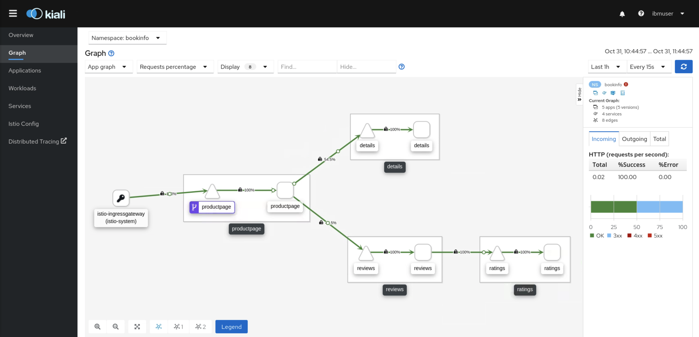

The Versioned App graph shows a node for each version of an app. All versions of an app are grouped together.

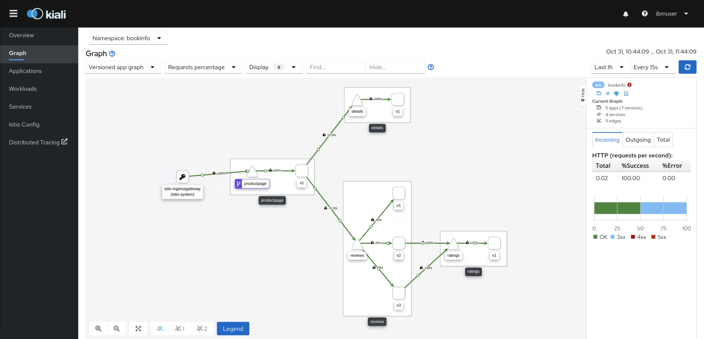

The Workload graph shows a node for each workload in your service mesh. This graph does not require you to use the app and version labels. If your app does not use version labels, use this the graph.


The Service graph shows a node for each service in your mesh but excludes all apps and workloads from the graph. It provides a high level view and aggregates all traffic for defined services.

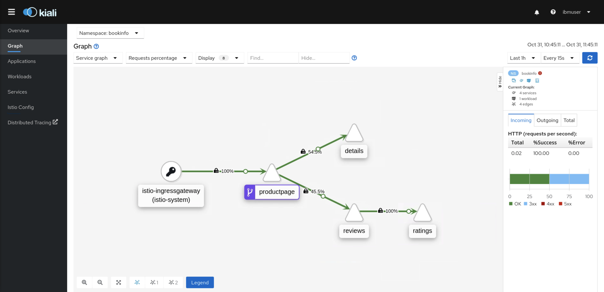

To view a summary of metrics, select any node or edge in the graph to display its metric details in the summary details panel.

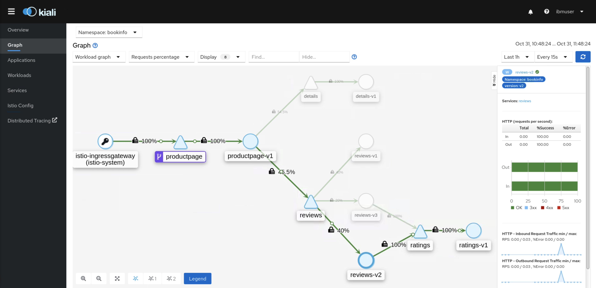

## Monitoring with Jaeger

Every time a user takes an action in an application, a request is executed by the architecture that may require dozens of different services to participate in order to produce a response. Jaeger lets you perform distributed tracing, which records the path of a request through various microservices that make up an application.

Distributed tracing is a technique that is used to tie the information about different units of work together — usually executed in different processes or hosts — to understand a whole chain of events in a distributed transaction. Developers can visualize call flows in large microservice architectures with distributed tracing. It’s valuable for understanding serialization, parallelism, and sources of latency.

Jaeger records the execution of individual requests across the whole stack of microservices, and presents them as traces. A trace is a data/execution path through the system. An end-to-end trace is comprised of one or more spans.

A span represents a logical unit of work in Jaeger that has an operation name, the start time of the operation, and the duration, as well as potentially tags and logs. Spans may be nested and ordered to model causal relationships.

Using Jaeger, we can view all the requests that pass through our Bookinfo microservices application and visualize metrics such as service execution times and potential latency issues.

Use the following URL to access the Jaeger dashboard

https://jaeger-istio-system.apps.demo.ibmdte.net

Log in with `ibmuser`.

In the left pane of the Jaeger dashboard, from the Service menu, select "productpage" and click the Find Traces button at the bottom of the pane. A list of traces is displayed, as shown in the following image

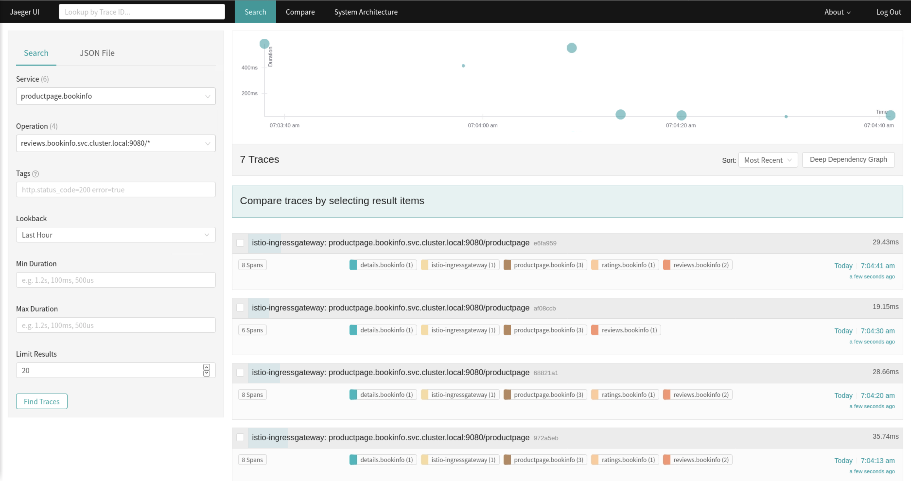

Click one of the traces in the list to open a detailed view of that trace. If you click on the top (most recent) trace, you see the details that correspond to the latest refresh of the `/productpage.

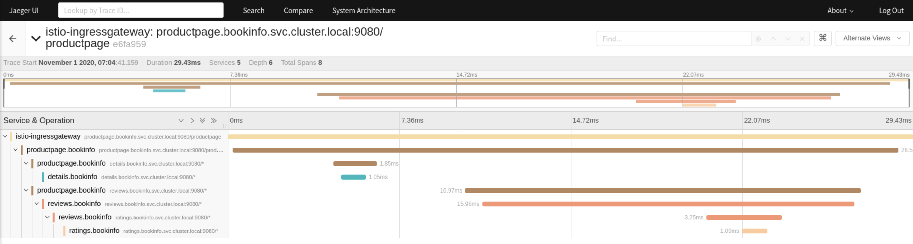


## Using Istio to Configure Traffic Routing

A common use case for using a Service Mesh is that we're able to easily shift traffic to different versions of each service, which allows for techniques such as A/B or Canary deployments. We achieve this in Istio by configuring the VirtualService objects for our microservices.

In this example, we're going to remove any requests sent to version 1 and 2 of the reviews service. By default, Istio is currently routing to all available versions in a round robin fashion. Let's change this so that we divert all of the traffic to v3.

Firstly, we're going to continuously run a curl command to query the product page in the background whilst we make changes. Open a new terminal window and execute the following command

```
while true; do curl -s http://istio-ingressgateway-istio-system.apps.demo.ibmdte.net/productpage >/dev/null && echo "OK"; sleep 1; done
```

Switch back to your usual terminal window.

Create a file called `reviews-vs.yaml` with the following content

```
apiVersion: networking.istio.io/v1alpha3
kind: VirtualService
metadata:
  name: reviews
spec:
  hosts:
  - reviews
  http:
  - route:
    - destination:
        host: reviews
        subset: v3
```

Create the VirtualService

```
$ oc apply -f reviews-vs.yaml 
virtualservice.networking.istio.io/reviews created
```

Now when we refresh the page multiple times, we should only see the red review stars.

Switch back to the Kiali dashboard. We can now see that all the requests are going to v3 and we can see the percentage of traffic hitting the v3 service going up. If you also change the time window on the right side of the page to `1m`, you should see 100% of requests going to the `v3` service.

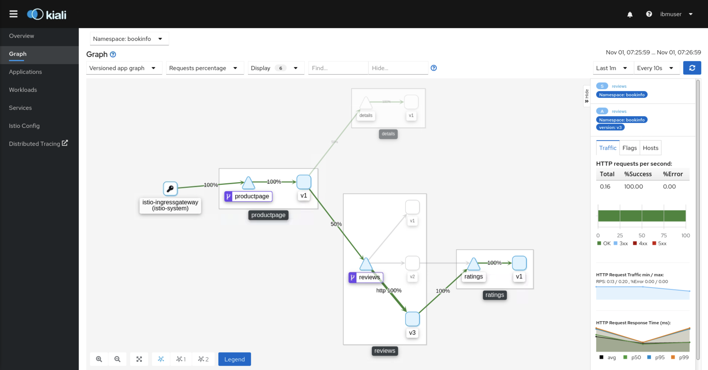

## Deploying Additional Service Versions

Another common use case is to deploy a new version of a service and split route a small percentage of traffic to that version to test that it is functioning correctly with the new features. In the next few steps we'll deploy a new v2 version of the ratings service that will include a MySQL database backend.

Create a file called `ratings-v2-mysql.yaml` with the following content

```
apiVersion: v1
kind: Secret
metadata:
  name: mysql-credentials
type: Opaque
data:
  rootpasswd: cGFzc3dvcmQ=
---
apiVersion: v1
kind: Service
metadata:
  name: mysqldb
  labels:
    app: mysqldb
spec:
  ports:
  - port: 3306
    name: tcp
  selector:
    app: mysqldb
---
apiVersion: apps/v1
kind: Deployment
metadata:
  name: mysqldb-v1
  labels:
    app: mysqldb
    version: v1
spec:
  replicas: 1
  selector:
    matchLabels:
      app: mysqldb
      version: v1
  template:
    metadata:
      annotations:
        sidecar.istio.io/inject: "true"
      labels:
        app: mysqldb
        version: v1
    spec:
      containers:
      - name: mysqldb
        image: maistra/examples-bookinfo-mysqldb:2.0.0
        imagePullPolicy: IfNotPresent
        ports:
        - containerPort: 3306
        env:
          - name: MYSQL_ROOT_PASSWORD
            valueFrom:
              secretKeyRef:
                name: mysql-credentials
                key: rootpasswd
        args: ["--default-authentication-plugin","mysql_native_password"]
        volumeMounts:
        - name: var-lib-mysql
          mountPath: /var/lib/mysql
      volumes:
      - name: var-lib-mysql
        emptyDir: {}
---
apiVersion: apps/v1
kind: Deployment
metadata:
  name: ratings-v2-mysql
  labels:
    app: ratings
    version: v2-mysql
spec:
  replicas: 1
  selector:
    matchLabels:
      app: ratings
      version: v2-mysql
  template:
    metadata:
      annotations:
        sidecar.istio.io/inject: "true"
      labels:
        app: ratings
        version: v2-mysql
    spec:
      containers:
      - name: ratings
        image: maistra/examples-bookinfo-ratings-v2:2.0.0
        imagePullPolicy: IfNotPresent
        env:
          - name: DB_TYPE
            value: "mysql"
          - name: MYSQL_DB_HOST
            value: mysqldb
          - name: MYSQL_DB_PORT
            value: "3306"
          - name: MYSQL_DB_USER
            value: root
          - name: MYSQL_DB_PASSWORD
            value: password
        ports:
        - containerPort: 9080
```

Create the resources

```
$ oc -n bookinfo create -f ratings-v2-mysql.yaml
secret/mysql-credentials created
service/mysqldb created
deployment.apps/mysqldb-v1 created
deployment.apps/ratings-v2-mysql created
```

Switch back to the Kiali dashboard and we can now see that our ratings v2 MySQL service has been added.

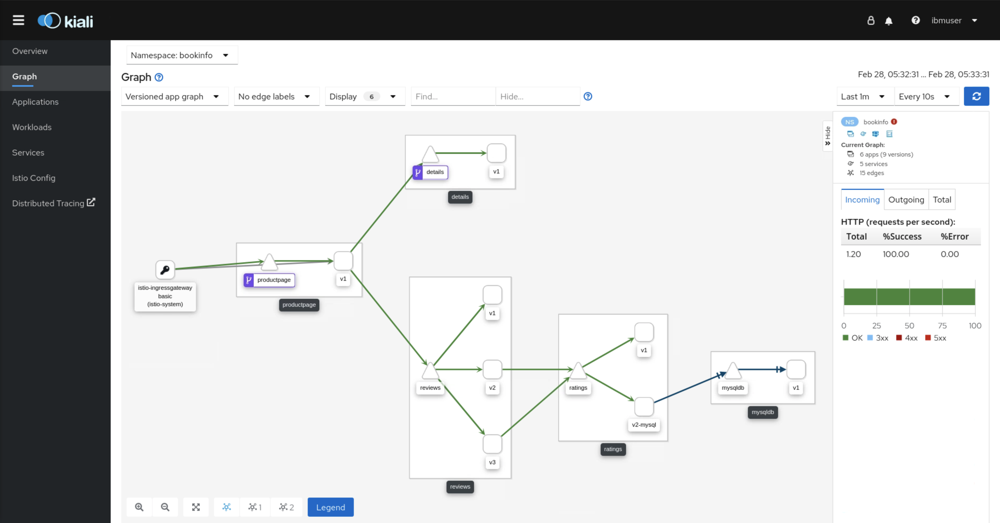

Create a new VirtualService to start splitting traffic

Create a file called `ratings-mysql-vs.yaml` with the following content

```
apiVersion: networking.istio.io/v1alpha3
kind: VirtualService
metadata:
  name: ratings
spec:
  hosts:
  - ratings
  http:
  - route:
    - destination:
        host: ratings
        subset: v1
      weight: 90
    - destination:
        host: ratings
        subset: v2-mysql
      weight: 10
```

Create the VirtualService

```
$ oc apply -f ratings-mysql-vs.yaml 
virtualservice.networking.istio.io/ratings created
```

Switch back to the Kiali dashboard and we should now see that roughly 90% of the requests hit the details v1 service, and 10% of the requests hit the details v2 service.

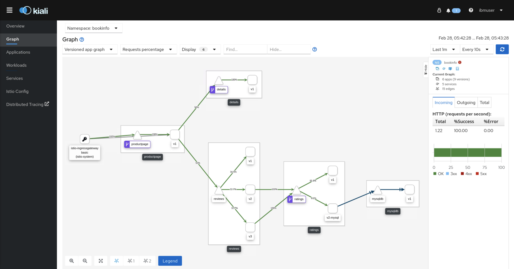


## Adding Custom Certificates to Services

By default, Red Hat OpenShift Service Mesh generates self-signed root certificate and key, and uses them to sign the workload certificates. In the next few steps, we'll use an existing set of certificates and use these in the Bookinfo application.

Retrieve the existing certificates from the [certs](certs/) directory.

Create a ConfigMap from these certificates using the below command

```
$ oc create secret generic cacerts -n istio-system --from-file=/home/ibmdemo/ibm-ocp-training/Labs/ServiceMesh/certs/ca-cert.pem --from-file=/home/ibmdemo/ibm-ocp-training/Labs/ServiceMesh/certs/ca-key.pem --from-file=/home/ibmdemo/ibm-ocp-training/Labs/ServiceMesh/certs/root-cert.pem --from-file=/home/ibmdemo/ibm-ocp-training/Labs/ServiceMesh/certs/cert-chain.pem
secrets/cacerts created
```

Now we need to edit the ServiceMeshControlPlane definition to disable the use of self-signed certificates. For this, use the command `oc -n istio-system edit smcp basic-install` as the `ibmadmin` user, then add the below code snippet under the `security` block

```
certificateAuthority:
  type: Istiod
  istiod:
    type: PrivateKey
    privateKey:
      rootCADir:  /etc/cacerts
```

Be sure to use the correct indentation. The result should look like the following

```
<additional content>
spec:
  version: v2.0
  security:
    controlPlane:
      mtls: true
    certificateAuthority:
      type: Istiod
      istiod:
        type: PrivateKey
        privateKey:
          rootCADir:  /etc/cacerts
<additional content>
```

The mutual TLS (mtls) should already be enabled from our original deployment YAML file `istio-installation.yaml`.

To make sure the workloads add the new certificates promptly, delete the secrets generated by Service Mesh, named istio.*. In this example, istio.default. Service Mesh issues new certificates for the workloads.

```
$ oc -n istio-system delete secret istio.default
oc delete secret istio.default
```

Also delete the running `galley` pods so they inherit the certificate chain to authenticate future requests

```
$ oc -n istio-system delete $(oc -n istio-system get po -l app=galley -o name)
pod "istio-galley-7485b8fcb4-6hjx2" deleted
```

### Verifying the Certificates

Use the Bookinfo sample application to verify your certificates are mounted correctly. First, retrieve the mounted certificates. Then, verify the certificates mounted on the pod.

Store the pod name in the variable RATINGSPOD.

```
$ RATINGSPOD=`oc get pods -l app=ratings -o jsonpath='{.items[0].metadata.name}'`
$ echo $RATINGSPOD
ratings-v1-5b848c9bdc-gv5cx
```

Run the following commands to retrieve the certificates mounted on the proxy.

```
$ oc exec -it $RATINGSPOD -c istio-proxy -- /bin/cat /etc/certs/root-cert.pem > /tmp/pod-root-cert.pem
```

The file /tmp/pod-root-cert.pem contains the root certificate propagated to the pod.

```
$ oc exec -it $RATINGSPOD -c istio-proxy -- /bin/cat /etc/certs/cert-chain.pem > /tmp/pod-cert-chain.pem
```

The file /tmp/pod-cert-chain.pem contains the workload certificate and the CA certificate propagated to the pod.

Verify the root certificate is the same as the one specified by the Operator. Replace <path> with the path to your certificates.

```
$ openssl x509 -in /home/ibmdemo/ibm-ocp-training/Labs/ServiceMesh/certs/root-cert.pem -text -noout > /tmp/root-cert.crt.txt

$ openssl x509 -in /tmp/pod-root-cert.pem -text -noout > /tmp/pod-root-cert.crt.txt

$ diff /tmp/root-cert.crt.txt /tmp/pod-root-cert.crt.txt
```

Expect the output to be empty.

Verify the CA certificate is the same as the one specified by Operator. Replace <path> with the path to your certificates.

```
$ sed '0,/^-----END CERTIFICATE-----/d' /tmp/pod-cert-chain.pem > /tmp/pod-cert-chain-ca.pem

$ openssl x509 -in /home/ibmdemo/ibm-ocp-training/Labs/ServiceMesh/certs/ca-cert.pem -text -noout > /tmp/ca-cert.crt.txt

$ openssl x509 -in /tmp/pod-cert-chain-ca.pem -text -noout > /tmp/pod-cert-chain-ca.crt.txt

$ diff /tmp/ca-cert.crt.txt /tmp/pod-cert-chain-ca.crt.txt
```

Expect the output to be empty.

Verify the certificate chain from the root certificate to the workload certificate. Replace <path> with the path to your certificates.

```
$ head -n 21 /tmp/pod-cert-chain.pem > /tmp/pod-cert-chain-workload.pem

$ openssl verify -CAfile <(cat /home/ibmdemo/ibm-ocp-training/Labs/ServiceMesh/certs/ca-cert.pem /home/ibmdemo/ibm-ocp-training/Labs/ServiceMesh/certs/root-cert.pem) /tmp/pod-cert-chain-workload.pem
/tmp/pod-cert-chain-workload.pem: OK
```


The Service Mesh has now been set up with custom certificates. 

Lab complete.